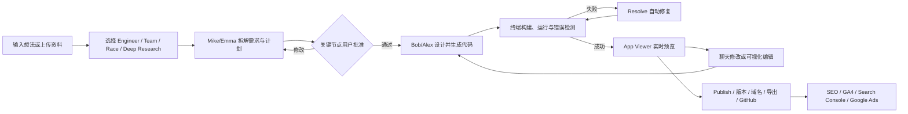
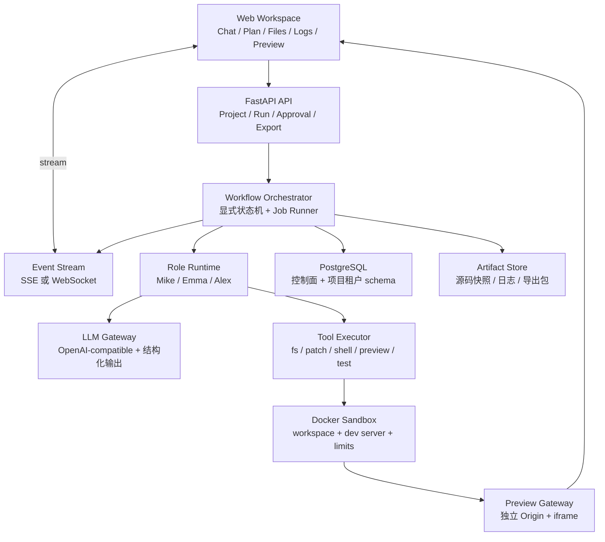
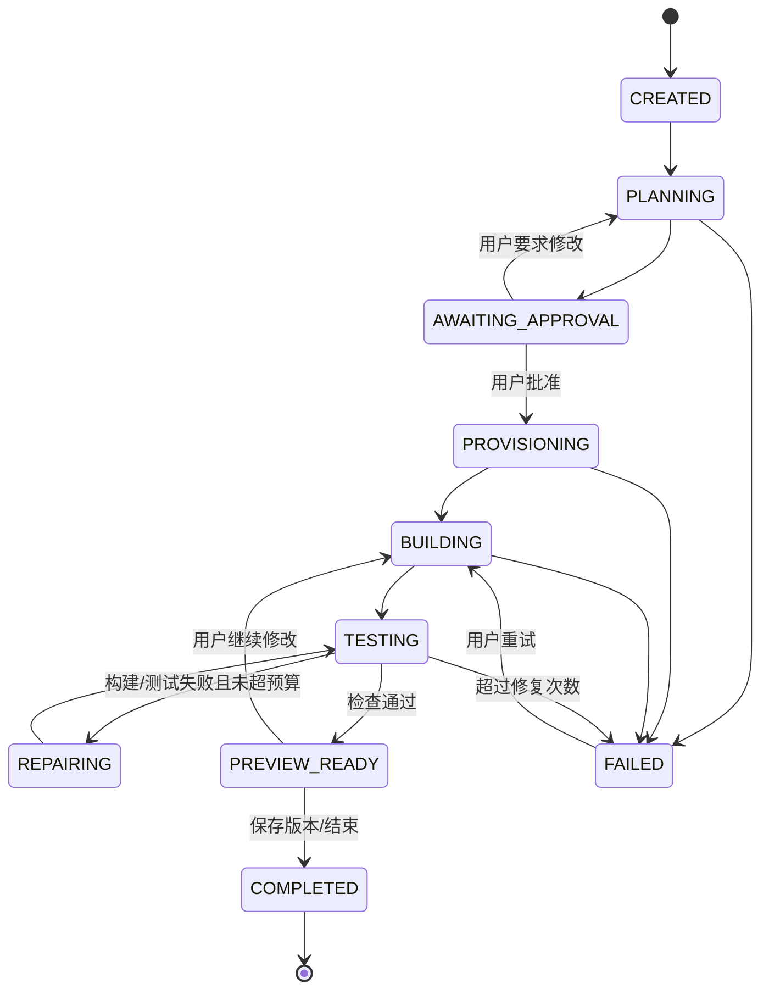

# Atoms 产品与开源实现参考调研（MetaGPT / OpenManus）

> 目标：为后续实现一个“真实可运行、可继续演进”的 Atoms Demo 提供产品、技术和范围依据。
> 调研日期：2026-08-16
> 调研对象：Atoms（atoms.dev）、MetaGPT、OpenManus
> 文档版本：v1.1（Demo 已按 PostgreSQL 项目租户约束落地）

## 1. 执行摘要

### 1.1 核心判断

Atoms 不是一个普通的 AI 编码聊天框，而是一个面向非技术创始人和小团队的“AI 产品团队 + 应用构建与增长平台”。其核心价值链是：

**需求/市场研究 → 产品定义 → 架构与开发 → 测试与预览 → 发布与托管 → SEO/广告/数据分析。**

它的差异化不只是“有多个 Agent”，而是把下列能力装进同一个产品工作区：

- 8 个角色化 Agent：Mike（团队负责人）、Emma（产品经理）、Bob（架构师）、Alex（工程师）、Iris（深度研究）、David（数据分析）、Sarah（SEO）、Adrian（广告）。
- Engineer / Team / Race / Deep Research 等运行模式。
- 聊天、计划、代码、终端、Console、实时预览、可视化编辑、自动修复一体化。
- 内建云后端、数据库、认证、Stripe、AI 调用、发布、版本和自定义域名。
- 发布后的 SEO、GA4 / Search Console、Google Ads 增长闭环。
- 代码下载和 GitHub 同步，降低平台锁定。

官方对产品关系的表述是：**MetaGPT（开源框架）→ MGX（AI 开发团队产品）→ Atoms（构建、发布和增长的商业产品）**。[Atoms 官方演进说明](https://atoms.dev/zh-TW/metagpt)

需要纠正一个容易产生误解的说法：

- **MetaGPT 是 Atoms 的开源技术上游和最接近的编排参考，但不是 Atoms SaaS 的完整开源版。**
- **OpenManus 是同一社区/团队成员推出的通用 Agent 开源框架，是工具执行与通用任务的参考，也不是 Atoms 的一比一开源版。**
- 两个开源仓库都不包含 Atoms 的完整 Web 产品、租户与计费、可视化编辑、托管、增长模块和生产级集成。

### 1.2 对 Demo 的建议

第一版不要追求复刻 Atoms 全部功能。可用 Demo 应聚焦一条真实闭环：

1. 用户输入要构建的 Web 应用。
2. Team 模式把需求转成结构化规格和计划。
3. 用户批准计划。
4. Engineer 在隔离 Sandbox 中生成/修改 React 项目。
5. 系统运行构建检查，失败时自动修复。
6. 在页面内显示文件、实时日志和可交互预览。
7. 用户通过第二轮自然语言要求继续修改。
8. 保存版本并导出 ZIP。

建议采用“**自研薄编排层 + 严格状态机**”，复用 MetaGPT 的角色/SOP思想和少量 Prompt/Schema，借鉴 OpenManus 的 ReAct、工具抽象、MCP 和计划状态，但不要直接把两套框架拼在一起。第一版只需 3 个逻辑角色：Mike、Emma、Alex；它们可以共用同一个模型，仅用不同系统提示和结构化输出实现角色分工。

---

## 2. 调研范围、方法与证据边界

### 2.1 调研范围

本次覆盖：

- Atoms 的定位、目标用户、用户流程、Agent 角色、构建、云、发布、增长、协作、计费形态。
- MetaGPT 当前主分支的 Team、Environment、Role、Planner、Memory、Tool、MGX 路由和软件开发角色。
- OpenManus 当前主分支的 BaseAgent、ReAct、ToolCall、PlanningFlow、Browser、Editor、Python 执行、MCP 和 Sandbox。
- 可落地 Demo 的产品范围、系统架构、数据模型、API、运行状态、安全边界、实施阶段和验收标准。

不在本次范围内：

- 付费账户内的完整 Atoms 项目实测与逆向分析。
- Atoms 私有后端、模型路由、云资源供应商和 Prompt 的内部实现。
- 广告账户、Stripe、域名等真实付费外部操作。

### 2.2 证据等级

| 等级 | 含义 | 本文用法 |
|---|---|---|
| A：官方产品事实 | Atoms 官网和帮助中心明确说明 | 功能、角色、限制、产品流程 |
| B：官方开源源码事实 | FoundationAgents 的 MetaGPT / OpenManus 仓库 | 编排、工具、状态、代码行为 |
| C：工程推断 | 由公开行为和源码模式推导 | Atoms 私有服务可能采用的实现方式 |

本文对 Atoms 私有架构的描述都会标注为“推断”或“建议实现”，不会把推断写成官方事实。

### 2.3 源码快照

本次阅读的主分支快照：

| 仓库 | 快照 commit | commit 时间 | License |
|---|---|---:|---|
| MetaGPT | `11cdf466d042aece04fc6cfd13b28e1a70341b1f` | 2026-01-21 | MIT |
| OpenManus | `52a13f2a57d8c7f6737eefb02ccf569594d44273` | 2026-01-04 | MIT |

---

## 3. Atoms 产品调研

### 3.1 产品定位

Atoms 的目标不是让用户“写一段代码”，而是让用户从想法出发，得到可以发布和增长的 Web 产品。官方列出的典型产物包括 SaaS、内部工具、AI 工具、Landing Page、Dashboard 和电商应用。[Atoms AI Agents](https://atoms.dev/ai-agents)

目标用户主要是：

- 没有完整研发团队的创业者和业务人员。
- 需要快速验证、搭建内部工具或营销站点的小团队。
- 希望 AI 直接处理产品、工程、部署和增长，而非只给建议的用户。
- 仍然要求代码所有权、可下载和可转 GitHub 的开发者。

其产品叙事经历了三个阶段：

1. **MetaGPT**：研究和开源框架，以 SOP 组织多 Agent 软件公司。
2. **MGX**：把框架产品化为可交互的 AI 开发团队。
3. **Atoms**：把构建扩展为“研究—构建—发布—增长”的业务闭环。

### 3.2 端到端用户流程

结合官网、帮助中心和公开页面，可还原出以下主流程：



其中最重要的体验特征是：

- Agent 的工作不是黑盒一次性返回；用户能看到角色、消息、计划、终端日志、Console 错误和产物。
- 关键步骤由用户批准；官方明确强调 Mike 在重要节点请求确认。[Atoms AI Agents](https://atoms.dev/ai-agents)
- App Viewer 与构建日志形成反馈闭环；出错后可以点击 Resolve 触发 Agent 修复。[App Viewer](https://help.atoms.dev/en/articles/12129698-app-viewer)
- 用户可继续用自然语言迭代，而不是重新生成整个项目。

### 3.3 Agent 团队与职责

| Agent | 主要职责 | 典型输入 | 典型输出 | Demo 优先级 |
|---|---|---|---|---|
| Mike / Team Leader | 理解意图、制定计划、路由任务、请求审批、汇总 | 用户目标、团队消息 | 计划、委派、审批请求、总结 | P0 |
| Emma / Product Manager | PRD、用户旅程、范围和优先级 | 原始想法、研究结论 | Product Spec / PRD | P0 |
| Bob / Architect | 技术方案、数据模型、接口和依赖 | PRD、约束 | Architecture Spec | P1；P0 可并入 Emma/Alex |
| Alex / Engineer | 前后端、集成、调试、部署 | 规格、代码库、日志 | 代码、修复、构建、预览 | P0 |
| Iris / Deep Researcher | 多源检索、可信报告、引用 | 研究问题 | 可追溯研究报告，可转 PDF/PPT/网页 | P2 |
| David / Data Analyst | 数据分析、可视化、建模、抓取 | 数据文件、业务问题 | Notebook、图表、洞察 | P2 |
| Sarah / SEO Specialist | 内容、meta、sitemap、收录准备 | 已发布站点、关键词 | SEO 页面、meta、sitemap | P2 |
| Adrian / Ads Specialist | Google Ads 计划、文案、投放、跟踪和优化 | 产品页、预算、目标用户 | Campaign、广告文案、指标 | P3 |

Atoms 当前公开页面给出 8 个角色；帮助中心的旧页面有时只列 7 个，遗漏 Adrian。本文以当前 AI Agents 页面和 Adrian 独立帮助文档为准。[Your Agents Team](https://help.atoms.dev/en/articles/12129380-your-agents-team) [Adrian Ads Agent](https://help.atoms.dev/en/articles/14342754-adrian-ads-agent-for-automated-campaigns)

### 3.4 运行模式

#### Engineer Mode

只启用 Alex，适用于 Landing Page、简单网站、快速原型和局部改动；速度更快、消耗更低。它说明 Atoms 并不把“多 Agent”教条化，而是按任务复杂度选择更小的执行单元。

#### Team Mode

多角色协作，适用于复杂产品、研究、架构、数据和增长任务。Sarah 和 Deep Research 默认依赖 Team Mode。

#### Race Mode

同一 Prompt 同时运行多个模型或多个候选，用户在约 5–10 分钟后选择一个结果，其余候选被丢弃。它更像“候选分支并行 + 人工选择”，不是普通的 Agent 并行。官方限制包括：仅 Max 套餐、成本较高、启用 Supabase 或 Stripe 时不可用。[Race Mode](https://help.atoms.dev/en/articles/12129504-race-mode)

#### Deep Research Mode

由 Iris 进行任务拆解、多源搜索、来源筛选和带引用的结构化报告；报告可下载为 PDF/Markdown，并可转为网页、PPT 或文档。该模式与 Race Mode 不兼容，且每次消息后需重新启用。[Deep Research](https://help.atoms.dev/en/articles/12136255-deep-research)

#### 产品启示

- “模式”是成本、延迟和质量的产品开关，不是单纯 UI 标签。
- Demo 应先实现 Engineer / Team 两种模式；Race 与 Deep Research 后置。
- Team 模式不必真正并行。对软件构建，顺序明确、产物可验证的 SOP 通常比自由聊天更可靠。

### 3.5 构建工作区与 App Viewer

公开文档显示工作区至少包含：

- Chat 与 Agent 消息。
- 计划/执行进度。
- 文件树和代码编辑器。
- Terminal 实时输出：文件创建、代码生成、命令和错误。
- Console：浏览器运行错误、文件行号和 stack trace。
- App Viewer：嵌入式实时预览，支持 Desktop / Tablet / Mobile 视口。
- Resolve：把错误送回 Agent 自动修复。
- Visual Editor：点击预览元素，修改颜色、间距、字体、布局和文本；带组件/图标/图片 Library。

#### 可能的实现方式（工程推断）

1. 每个项目或 Run 拥有独立工作目录和开发服务器。
2. 平台通过反向代理将 Sandbox 端口映射为可访问 Preview URL。
3. 前端以独立 Origin 的 `iframe` 加载预览，避免生成应用影响平台主页面。
4. Terminal、文件变更和 Agent 事件通过 SSE/WebSocket 增量推送。
5. Console 通过预览页注入的 bridge 捕获 `error`、`unhandledrejection` 和 console 输出，再用 `postMessage` 传给父页面。
6. Resolve 将结构化错误、构建日志、当前代码版本和验收标准重新交给 Alex，形成有限次数的修复循环。
7. Visual Editor 在 iframe 中注入元素高亮 Overlay，通过 CSS selector、稳定的 `data-*` ID 或源码映射定位组件；属性变更再转成 AST/CSS Patch。该能力比普通聊天改代码复杂很多，建议后置。

### 3.6 Atoms Cloud、发布与集成

Atoms Cloud 的公开能力包括：数据库、用户认证、Stripe、域名、API Key 管理和 AI 集成。[Atoms Cloud](https://help.atoms.dev/en/articles/13036940-atoms-cloud)

公开文档还显示：

- Cloud 能自动识别后端需求并配置；为了避免数据库结构与历史代码冲突，Cloud 项目会限制历史版本，只保留最新构建。
- Publish 产生稳定公共链接，可更新、下线、固定到指定版本或跟随最新版本，并可连接自定义域名。[Publish](https://help.atoms.dev/en/articles/12129484-publish)
- 代码可下载为 ZIP，也可通过 GitHub Connect 做 Push/Pull；当前新的 GitHub Connect 是 Pro+ 功能。[GitHub Connect](https://help.atoms.dev/en/articles/13222322-github-connect)
- Stripe 的新产品说明把它作为 Atoms Cloud 支付能力；部分旧 MGX 文档仍展示 Supabase Edge Functions 路线，说明产品经历过从第三方 BaaS 到更内建 Cloud 的迁移。[Stripe Connect](https://help.atoms.dev/en/articles/12129347-stripe-connect)

#### Demo 取舍

第一版不应自研完整 BaaS。结合本 Demo“生成结果必须真实可用”的验收约束，建议：

- P0：生成 FastAPI + 前端完整应用，业务数据统一写入 PostgreSQL；每个项目使用独立 `tenant_<project_uuid>` schema，禁止 SQLite、内存和 localStorage 作为最终数据源。
- P1：增加数据库角色隔离、迁移管理、租户配额，或接入 Supabase 等可选 BaaS。
- P2：认证、Secret Broker、Stripe Test Mode、版本化发布和域名。

### 3.7 发布后的增长闭环

Atoms 与一般 AI Builder 最大的产品差异之一是“发布后继续工作”：

- Sarah 生成结构化 SEO 内容、meta、canonical 和 `sitemap.xml`，并指导/协助 Search Console 收录。[SEO](https://help.atoms.dev/en/articles/12129510-search-engine-optimization-seo)
- Marketing 模块连接 GA4 和 Search Console，展示流量、用户行为、Indexed Pages、Clicks、Impressions、CTR 和 Position。[Marketing Module](https://help.atoms.dev/en/articles/14057591-marketing-module-guide)
- Adrian 读取产品和 Landing Page，生成广告文案、目标、预算、出价和 Campaign；经用户批准后连接 Google Ads，并跟踪 CTR、Spend、Conversion、ROAS、CPC、CPA 等指标。[Adrian Ads Agent](https://help.atoms.dev/en/articles/14342754-adrian-ads-agent-for-automated-campaigns)

广告和支付会产生真实外部影响，因此必须有“预览 → 人工批准 → 执行 → 审计”四段式控制；不能让 Agent 直接根据自然语言无确认地花费资金。

### 3.8 协作与商业化

- Workspace 支持 Owner / Editor、实时共享 Chat 历史、统一 Credits 和集中计费。[Team Workspace](https://help.atoms.dev/en/articles/12129353-team-workspace)
- 产品同时存在“构建 Credits”和“Cloud & AI Wallet”：前者控制 Agent 构建消耗，后者承担上线应用的计算、存储、网络和 AI 用量。[Cloud & AI Wallet](https://help.atoms.dev/en/articles/14432563-cloud-ai-wallet)
- 对 Demo 来说，不必实现订阅计费，但应从一开始记录每次模型调用、工具时间、Token 和 Sandbox 资源，便于后续形成配额体系。

### 3.9 已知边界与文档不一致

公开资料存在以下边界，不能按营销口径无限外推：

- 当前主要支持 Web App；不直接生成 APK。[Build & Export](https://help.atoms.dev/en/articles/12129478-build-export)
- Atoms 支持生成和编辑 Next.js 代码，但帮助中心称暂不直接托管 Next.js，需要下载后自行部署。
- 静态单 HTML 文件没有一键托管，但可在 Editor 内预览。[Deployment Options](https://help.atoms.dev/en/articles/12129483-deployment-options)
- 旧文档仍混用 MGX、Supabase 和新 Atoms Cloud；实现 Demo 时应以当前目标体验为准，不照搬历史品牌结构。
- 官网“生产可用”的描述是产品主张，不代表任意生成应用都天然满足安全、可扩展和合规要求。

---

## 4. MetaGPT 源码分析

### 4.1 定位与核心思想

MetaGPT 是 Python 多 Agent 框架，核心理念是 `Code = SOP(Team)`：将真实软件团队的标准作业流程编码为 Agent 角色、Action、消息依赖和顺序。论文强调用 SOP 和中间产物验证来降低简单串联 LLM 时的级联幻觉。[MetaGPT 论文](https://arxiv.org/abs/2308.00352) [MetaGPT README](https://github.com/FoundationAgents/MetaGPT)

核心抽象可概括为：

```text
Team
 ├─ Environment / MGXEnv：共享环境、消息路由、历史
 ├─ Role：身份、目标、Memory、Planner、可观察消息、Actions
 ├─ Action：结构化的一次工作，如 WritePRD / WriteDesign / RunCommand
 ├─ Message：发送者、接收者、cause_by、内容、结构化产物
 ├─ Tool：Browser / Editor / Terminal / Search / Deployer 等
 └─ ProjectRepo：需求、设计、代码、资源和变更文件的项目存储
```

### 4.2 当前 MGX 路径与 Atoms 的关系

当前 `software_company.generate_repo()` 默认启用 MGX 环境，并雇佣：

- TeamLeader
- ProductManager
- Architect
- Engineer2
- DataAnalyst

源码：[software_company.py（固定快照）](https://github.com/FoundationAgents/MetaGPT/blob/11cdf466d042aece04fc6cfd13b28e1a70341b1f/metagpt/software_company.py)

这与 Atoms 的 Mike / 产品经理 / Bob / Alex / David 高度对应，是公开源码中最接近产品编排的一条路径；Iris、Sarah、Adrian 和 SaaS 产品层不在该开源入口中。

### 4.3 Team 与运行循环

`Team` 负责：

- 创建 `MGXEnv`。
- Hire 角色并注入环境。
- 设置最大预算，由 CostManager 统计模型成本。
- 将用户需求发布为 Message。
- 按轮驱动 Environment，直到所有角色 idle、轮数耗尽或预算不足。
- 序列化/恢复 Team 和 Context，结束后归档。

源码：[team.py（固定快照）](https://github.com/FoundationAgents/MetaGPT/blob/11cdf466d042aece04fc6cfd13b28e1a70341b1f/metagpt/team.py)

这种“轮次 + 消息驱动”适合研究框架；Web 产品应将它改造成可持久化 Run 状态机和异步 Job，否则服务重启、暂停审批、长任务恢复和多租户并发会比较困难。

### 4.4 MGXEnv 与 Team Leader 路由

`MGXEnv.publish_message()` 的关键行为：

- 普通消息先发送给 Team Leader Mike。
- Mike 处理后的消息再发布给指定角色。
- 支持用户直接 `@角色`，空闲角色可绕过 Mike 做直接会话。
- 支持公聊/直聊、多模态图片、对 Human 提问和回复。
- 在消息文本中显式加入 From/To，帮助模型理解协作关系。

源码：[mgx_env.py（固定快照）](https://github.com/FoundationAgents/MetaGPT/blob/11cdf466d042aece04fc6cfd13b28e1a70341b1f/metagpt/environment/mgx/mgx_env.py)

`TeamLeader.publish_team_message()` 会暂停自己并把完整上下文委派给成员，源码中特别要求不能遗漏路径、链接、环境、语言、框架和约束。[team_leader.py（固定快照）](https://github.com/FoundationAgents/MetaGPT/blob/11cdf466d042aece04fc6cfd13b28e1a70341b1f/metagpt/roles/di/team_leader.py)

这是 Demo 最值得借鉴的设计：**上游产物必须以结构化交接包传给下游角色，不能只转发一句自然语言摘要。**

### 4.5 Role、Memory、Planner 与 ReAct

MetaGPT `Role` 具备：

- 独立 Memory、Working Memory、Message Buffer。
- `_watch()` 指定关注哪些 Action 的输出。
- `react`、`by_order`、`plan_and_act` 三种决策模式。
- Observe → Think → Act → Publish 标准循环。
- Action 状态选择、最大循环、防止无限执行、HumanProvider。

源码：[role.py（固定快照）](https://github.com/FoundationAgents/MetaGPT/blob/11cdf466d042aece04fc6cfd13b28e1a70341b1f/metagpt/roles/role.py)

较新的 `RoleZero` 把 Agent 变成动态工具调用者：

- 用 Planner 管理 Goal 和 Task。
- 通过 Tool Recommender 给当前角色提供工具 Schema。
- LLM 输出命令，框架解析并执行 Browser、Editor、Terminal 等工具。
- 支持 Ask Human、快速问答、重复检测、长记忆和结束总结。

源码：[role_zero.py（固定快照）](https://github.com/FoundationAgents/MetaGPT/blob/11cdf466d042aece04fc6cfd13b28e1a70341b1f/metagpt/roles/di/role_zero.py)

### 4.6 软件产物流水线

传统固定 SOP 的主要产物是：

```text
UserRequirement
  → PrepareDocuments
  → WritePRD
  → WriteDesign
  → WriteTasks / Project Management
  → WriteCode
  → RunCode / Debug / QA
```

`WritePRD` 支持新项目、需求增量和 Bugfix 三种路径，并保存 PRD、竞品分析和 Mermaid 图；`WriteDesign` 根据变更 PRD 更新数据结构、接口和序列图；`WriteCode` 按单文件生成，读取设计、任务、已有代码、测试日志和 Bug 反馈。

源码示例：

- [write_prd.py（固定快照）](https://github.com/FoundationAgents/MetaGPT/blob/11cdf466d042aece04fc6cfd13b28e1a70341b1f/metagpt/actions/write_prd.py)
- [design_api.py（固定快照）](https://github.com/FoundationAgents/MetaGPT/blob/11cdf466d042aece04fc6cfd13b28e1a70341b1f/metagpt/actions/design_api.py)
- [write_code.py（固定快照）](https://github.com/FoundationAgents/MetaGPT/blob/11cdf466d042aece04fc6cfd13b28e1a70341b1f/metagpt/actions/write_code.py)

这种“文档和代码均为显式 Artifact”的方式很适合 Demo：每个阶段都有可存储、可审核、可重跑、可追踪的输出。

### 4.7 Alex 的工程工具

当前 `Engineer2` 的工具列表包含 Planner、Editor、Terminal、Browser、Search、CodeReview、ImageGetter、Deployer 和 Git 操作；最多可运行 40 轮，能创建新文件、执行命令、修复代码并部署静态产物。

源码：[engineer2.py（固定快照）](https://github.com/FoundationAgents/MetaGPT/blob/11cdf466d042aece04fc6cfd13b28e1a70341b1f/metagpt/roles/di/engineer2.py)

这说明 Atoms 式工程 Agent 的核心不是更长 Prompt，而是：

- 可持续工作的 Workspace。
- 精确文件编辑工具。
- 可观察的终端和浏览器。
- 计划、测试、修复和部署反馈。
- 限制循环、预算和人工求助。

### 4.8 可复用点与缺口

可复用或借鉴：

- 角色、Action、Message、Memory、Planner 的抽象。
- Team Leader 中央路由和 `@角色` 直聊。
- PRD/设计/代码的结构化 Schema 与依赖关系。
- Tool Registry、LLM Provider、CostManager。
- ProjectRepo、增量需求、变更文件跟踪。
- Reporter 事件，可映射为前端流式状态。

不宜直接作为产品后端整体使用：

- `generate_repo()` 是 CLI/库式同步入口，内部直接 `asyncio.run`，并非多租户任务服务。
- 轮次循环不等于可恢复工作流；审批等待、任务重试、取消和幂等需要额外实现。
- 缺少生产级租户、权限、OAuth/Secrets、配额、队列、审计和预览网关。
- 开源 README 的 Python 约束仍是 3.9–3.11，依赖和部分历史路径较重。
- 不包含 Atoms 的完整 UI、Cloud、Visual Editor、Growth Agent 和商业模块。

---

## 5. OpenManus 源码分析

### 5.1 定位

OpenManus 是一个极简通用 Agent 框架，目标是让 LLM 通过工具完成浏览、编辑、计算和通用任务。README 明确称它是简洁实现，并把 `run_flow.py` 的多 Agent 版本标记为 unstable。[OpenManus README](https://github.com/FoundationAgents/OpenManus)

它更接近“开源 Manus 风格执行 Agent”，而不是 Atoms 的产品构建团队。

### 5.2 核心运行模型

```text
BaseAgent.run
  └─ while step < max_steps
      └─ ReActAgent.step
          ├─ think：LLM 选择工具调用
          └─ act：执行工具，观察结果写入 Memory
```

`BaseAgent` 管理 IDLE/RUNNING/FINISHED/ERROR 状态、Memory、步数和简单重复检测。[base.py（固定快照）](https://github.com/FoundationAgents/OpenManus/blob/52a13f2a57d8c7f6737eefb02ccf569594d44273/app/agent/base.py)

`ToolCallAgent` 将工具转成 OpenAI Function Calling Schema，执行工具后把 Observation 写回消息，并用 Terminate 工具结束。[toolcall.py（固定快照）](https://github.com/FoundationAgents/OpenManus/blob/52a13f2a57d8c7f6737eefb02ccf569594d44273/app/agent/toolcall.py)

### 5.3 默认 Manus Agent

默认 Manus 最大 20 步，工具包括：

- `python_execute`
- `browser_use`
- `str_replace_editor`
- `ask_human`
- `terminate`
- 配置的 MCP Server 工具

它在最近几步使用 Browser 时，会动态把浏览器上下文加入下一轮 Prompt。MCP 支持 SSE 和 stdio，并能动态添加/移除工具。[manus.py（固定快照）](https://github.com/FoundationAgents/OpenManus/blob/52a13f2a57d8c7f6737eefb02ccf569594d44273/app/agent/manus.py)

### 5.4 Browser、文件与计划

- Browser 基于 `browser-use` / Playwright，支持导航、点击、输入、滚动、提取内容、搜索、Tab 管理和状态保持。[browser_use_tool.py（固定快照）](https://github.com/FoundationAgents/OpenManus/blob/52a13f2a57d8c7f6737eefb02ccf569594d44273/app/tool/browser_use_tool.py)
- Editor 支持 view、create、str_replace、insert 和 undo，长文件自动截断；可选择本地或 Sandbox File Operator。[str_replace_editor.py（固定快照）](https://github.com/FoundationAgents/OpenManus/blob/52a13f2a57d8c7f6737eefb02ccf569594d44273/app/tool/str_replace_editor.py)
- PlanningTool 维护 Plan、Steps、Notes 和 `not_started / in_progress / completed / blocked` 状态。
- PlanningFlow 先让 LLM 创建计划，再按 Step 的 `[agent_name]` 标签选择执行者；未指定时使用第一个 Agent。[planning.py（固定快照）](https://github.com/FoundationAgents/OpenManus/blob/52a13f2a57d8c7f6737eefb02ccf569594d44273/app/flow/planning.py)

### 5.5 Sandbox 与安全问题

OpenManus 包含 DockerSandbox：

- 容器 CPU、内存、超时限制。
- 默认关闭网络，开启时使用 bridge。
- 独立工作目录、文件复制和终端命令。
- 路径中的 `..` 检查和运行后清理。

源码：[sandbox.py（固定快照）](https://github.com/FoundationAgents/OpenManus/blob/52a13f2a57d8c7f6737eefb02ccf569594d44273/app/sandbox/core/sandbox.py)

但不能把默认 OpenManus 当成生产安全 Sandbox：

- 配置中的 `use_sandbox` 默认是 `false`。
- 默认 Manus 使用的 `PythonExecute` 在主机子进程内直接 `exec()`，并复制完整 Python builtins；类注释虽写着 safety restrictions，代码并没有形成真正的能力隔离。[python_execute.py（固定快照）](https://github.com/FoundationAgents/OpenManus/blob/52a13f2a57d8c7f6737eefb02ccf569594d44273/app/tool/python_execute.py)
- Browser 默认也是本地浏览器上下文。
- 文件工具仅在 `config.sandbox.use_sandbox` 开启时切换 Sandbox Operator；这不自动覆盖所有工具。

因此 Demo 必须把 Shell、Python、包安装和生成应用统一放到容器里，禁止任何“工具自行决定是否在 Host 执行”的分叉。

### 5.6 可复用点与缺口

可复用或借鉴：

- BaseAgent / ReAct / ToolCall 的简洁循环。
- ToolCollection 和统一 Function Schema。
- PlanningTool 的步骤状态。
- Browser、精确文本编辑、MCP Client。
- DockerSandbox 的资源限制和 File Operator 接口。

缺口：

- 默认单 Agent；多 Agent 流程简单且官方标为不稳定。
- CLI 产品，无工作区、项目、预览、事件流和协作 UI。
- 无产品 SOP、PRD/Architecture Artifact 和可审查交接。
- 无多租户、权限、版本、部署、云后端、增长和计费。
- 默认安全配置不适合直接暴露给不可信用户。

---

## 6. Atoms、MetaGPT、OpenManus 横向对比

| 维度 | Atoms | MetaGPT | OpenManus |
|---|---|---|---|
| 定位 | 商业化 AI 产品团队与应用/增长平台 | 多 Agent / SOP 研究与开发框架 | 通用工具执行 Agent 框架 |
| 开源 | 否，产品闭源 | 是，MIT | 是，MIT |
| 默认协作 | 8 个角色、Team Leader、模式切换 | Team + Environment + Role + Action | 默认单 Agent；可选 PlanningFlow |
| 核心范式 | 研究→计划→构建→发布→增长 | SOP、消息订阅、结构化中间产物 | ReAct、Function Calling、工具观察 |
| Human-in-the-loop | 关键节点审批、聊天干预 | AskHuman / HumanProvider，可扩展 | AskHuman 工具 |
| 工程工具 | 文件、终端、预览、Console、Resolve、Visual Editor | Editor、Terminal、Browser、CodeReview、Deployer | Browser、Python、Editor、MCP、可选 Sandbox |
| 应用预览 | 完整 App Viewer，多视口 | 仅底层工具/Reporter，不含产品 UI | 无产品 UI |
| 后端与发布 | Atoms Cloud、Auth、DB、Stripe、域名、版本 | 不含托管平台 | 不含托管平台 |
| 增长 | SEO、GA4、Search Console、Ads | 少量 Research/Data 能力，无商业增长产品 | 无 |
| 项目持久化 | SaaS Workspace、版本、导出、GitHub | ProjectRepo、Team 序列化/归档 | Memory 和本地 Workspace，较薄 |
| 安全隔离 | 私有实现未知 | 非产品级 Sandbox | 有 DockerSandbox，但默认未全面启用 |
| Demo 价值 | 目标体验与验收基准 | 角色、SOP、消息路由、Artifact | 工具循环、计划、Browser、MCP、Sandbox 接口 |

### 结论

Atoms 的核心护城河并不是某一个 Agent 类，而是以下系统能力的组合：

1. 受控而可解释的长流程编排。
2. 能真正读写、构建、运行和验证代码的环境。
3. 把 Agent 内部事件变成易理解的产品 UI。
4. Cloud、Preview、Deploy、Auth、Payment 等“最后一公里”。
5. 研究、SEO、分析、广告形成的业务闭环。

仅运行 MetaGPT 或 OpenManus，都无法得到一个 Atoms Demo 产品。

---

## 7. 建议的 Atoms Demo 产品定义

### 7.1 Demo 目标

Demo 不是静态交互稿，也不是预设结果播放。它必须做到：

- 用户给出一个新需求后，平台真实调用模型并生成项目文件。
- 所有代码操作在隔离环境真实执行。
- 用户能看到真实日志、真实构建结果和真实 Web 预览。
- 用户可继续提出修改，系统在已有项目上增量修改。
- 构建失败能把真实错误送回 Agent，至少自动修复一次。
- 项目和版本在页面刷新后仍存在，并能导出。

### 7.2 目标用户故事

> 作为一个不会完整开发流程的产品经理，我输入“做一个简洁的客户反馈看板”，查看 AI 生成的产品计划并批准；几分钟后看到可操作的网页。我要求“增加优先级筛选和深色模式”，系统修改已有代码、重新构建并刷新预览。最后我可以下载源码。

推荐首个演示模板：

- React + TypeScript + Vite。
- Tailwind 或固定设计系统。
- 允许多页面、表单、列表、筛选、图表。
- P0 数据层使用 Compose 内置 PostgreSQL，并通过项目 schema 隔离，确保无需外部账户也能完整演示真实后端。

### 7.3 P0 / P1 / P2 范围

| 能力 | P0：可用 Demo | P1：增强版 | P2/P3：产品化 |
|---|---|---|---|
| 登录/租户 | 单用户或简易登录 | 多用户项目权限 | Workspace、Owner/Editor、组织 |
| 模式 | Engineer、Team | 手动 @Agent | Race、Deep Research |
| Agent | Mike、Emma、Alex | Bob、QA | Iris、David、Sarah、Adrian |
| 计划 | 结构化计划、审批 | 重规划、单步重跑 | DAG、并行候选和自动评估 |
| 代码 | React 模板增量修改 | 多模板/Next.js | Full-stack 多语言 |
| Sandbox | 每个 Run 独立 Docker | Sandbox Pool | 远程隔离、弹性伸缩 |
| 预览 | iframe、桌面/手机、刷新 | Console Bridge、截图 | Visual Editor、组件库 |
| 修复 | build 失败自动修 1–3 次 | 浏览器运行错误修复 | 视觉回归和 E2E |
| 持久化 | Project、Run、Event、Artifact、Version | 分支/回滚 | 团队审计、策略和合规 |
| 导出/发布 | ZIP、临时 Preview URL | GitHub、稳定发布 URL | 域名、版本锁定、CDN |
| Cloud | 不做或本地模板 | Postgres/Auth 模板 | BaaS、Stripe、AI Wallet |
| Growth | 不做 | 基础 meta/sitemap | GA4/GSC/Ads 完整闭环 |

### 7.4 明确不做

P0 不做以下内容，否则会稀释主闭环：

- 真实 Google Ads 投放。
- 真实 Stripe 收款。
- 自研数据库/Auth/域名平台。
- 多模型 Race。
- 像素级 Visual Editor。
- 任意技术栈和任意移动 App。
- 无上限自主运行。
- Agent 自动使用用户 Token 推送代码。

---

## 8. Demo 推荐架构

### 8.1 总体架构



#### 推荐技术栈

| 层 | P0 建议 | 说明 |
|---|---|---|
| Web | React + TypeScript；可用 Next.js 做平台壳 | Chat、计划、代码、日志、Preview 多面板 |
| API | FastAPI + Pydantic | 与 MetaGPT/OpenManus 的 Python 生态兼容，结构化 Schema 方便 |
| Workflow | 自研显式状态机 + asyncio Job | P0 比直接引入重型工作流系统更容易控制；接口预留持久化队列 |
| DB | PostgreSQL 16 | `public` 存控制面元数据；每项目独立 schema 存生成应用业务数据；不把大型 Artifact 塞进 DB |
| Event | SSE | 单向日志/状态流足够；需要多人协同时再换 WebSocket |
| Sandbox | Docker | 每 Run 或每 Project 隔离；Windows 开发依赖 Docker Desktop |
| Artifact | 本地目录，后续 S3 兼容对象存储 | 源码快照、ZIP、日志、截图 |
| Preview | 反向代理 + 独立子域/Origin | iframe 隔离生成应用 |
| LLM | 一个支持 Tool Calling/JSON Schema 的模型 | 先保证稳定；多模型路由后置 |

### 8.2 为什么不直接以 MetaGPT 或 OpenManus 为主框架

#### 直接 MetaGPT

优点：角色/SOP、MGX 路由、PRD 和工程工具最接近 Atoms。
问题：框架历史包袱和抽象较多，CLI/轮次运行不等于 Web 服务，恢复、审批和 Sandbox 仍要重做。

#### 直接 OpenManus

优点：Agent 循环和 ToolCall 简单，容易读懂和改造。
问题：默认单 Agent、产品 SOP 弱、默认安全不足，仍需补整个产品壳。

#### 推荐

创建统一的内部接口：

```text
AgentRuntime.think(context) -> AgentDecision
ToolExecutor.execute(tool_call, sandbox) -> ToolResult
Workflow.transition(event) -> next_state
ArtifactStore.save(type, content) -> artifact_id
EventBus.publish(run_id, AgentEvent)
```

把 MetaGPT 的角色 Prompt、Artifact Schema、Team Leader 路由作为上层策略；把 OpenManus 的工具接口和部分 Browser/MCP/Sandbox 代码通过 Adapter 接入。不要同时保留两套 Memory、Plan、Message 和 ToolCollection。

### 8.3 工作流状态机



每次转移都必须写入 Event Store；Run 可以暂停在 `AWAITING_APPROVAL`，服务重启后从 DB 恢复，而不是靠内存中的协程一直等待。

### 8.4 角色实现

#### Mike

职责：分类意图、选择 Engineer/Team、维护计划、分派角色、检查是否需要人工审批、汇总结果。
不要给 Mike Shell/文件写权限；它只操作 Plan 和消息。

#### Emma

输出严格的 `ProductSpec`：

```json
{
  "name": "Feedback Board",
  "summary": "...",
  "target_users": ["..."],
  "pages": [{"name": "Dashboard", "purpose": "..."}],
  "features": [{"id": "F1", "priority": "must", "description": "..."}],
  "non_goals": ["..."],
  "acceptance_criteria": ["..."],
  "tech_constraints": ["React", "TypeScript", "No external account"]
}
```

#### Alex

只通过工具操作 Sandbox；建议工具集：

- `list_files(path)`
- `read_file(path, start, end)`
- `search_code(query, glob)`
- `apply_patch(patch)`
- `run_command(argv, cwd, timeout)`
- `get_build_status()`
- `get_preview_errors()`
- `finish(summary)`

优先使用 Patch 而不是整文件覆写。每次工具调用写入事件，并限制：最大工具轮数、Token、耗时和模型费用。

#### QA（可先作为系统步骤而非独立 Agent）

固定执行：

1. `npm run typecheck`（若模板提供）。
2. `npm run build`。
3. 启动 dev/preview server。
4. HTTP health check。
5. 可选 Playwright 打开首页并检查严重 Console Error。

固定检查比让 QA Agent 自由发挥更便宜、更稳定。

### 8.5 Artifact 与交接包

建议所有角色不直接“聊天交接”，而是保存并引用 Artifact：

| Artifact | 生产者 | 消费者 |
|---|---|---|
| `product_spec.json` | Emma | 用户、Mike、Alex |
| `implementation_plan.json` | Mike | 用户、Alex、Workflow |
| `architecture.json` | Bob/P1 | Alex、QA |
| `workspace_snapshot` | Sandbox | Version、Export、Repair |
| `build_report.json` | QA | Mike、Alex、UI |
| `preview_manifest.json` | Preview Service | UI、Publish |
| `run_summary.md` | Mike | 用户、历史上下文 |

对每个 Artifact 记录 `project_id`、`run_id`、`version`、`producer`、`schema_version`、`content_hash` 和时间。

### 8.6 核心数据模型

```text
Project
  id, owner_id, name, mode, current_version_id, created_at

Run
  id, project_id, parent_run_id, goal, state, budget, started_at, ended_at

PlanStep
  id, run_id, order, title, owner_agent, status, artifact_ids

AgentEvent
  id, run_id, seq, agent, type, phase, public_summary, payload, created_at

Artifact
  id, project_id, run_id, type, uri, hash, schema_version, created_at

Version
  id, project_id, run_id, workspace_snapshot_uri, preview_url, build_status

SandboxLease
  id, project_id, run_id, sandbox_id, status, expires_at
```

`AgentEvent.payload` 可以保存完整工具参数和内部错误，但 UI 默认只展示 `public_summary`，避免把原始 Chain-of-Thought 当成产品内容。

### 8.7 建议 API

```http
POST   /api/projects
GET    /api/projects/{project_id}
POST   /api/projects/{project_id}/runs
GET    /api/runs/{run_id}
GET    /api/runs/{run_id}/events        # SSE
POST   /api/runs/{run_id}/approve
POST   /api/runs/{run_id}/reject
POST   /api/runs/{run_id}/cancel
POST   /api/projects/{project_id}/messages
GET    /api/projects/{project_id}/files
GET    /api/projects/{project_id}/versions
POST   /api/projects/{project_id}/versions/{version_id}/restore
GET    /api/projects/{project_id}/export
GET    /preview/{sandbox_or_version_id}/{path}
```

所有改变状态的请求需要 Idempotency Key，避免用户双击或网络重试导致重复生成和重复扣费。

### 8.8 Preview 与日志

P0 实现建议：

1. Sandbox 从只读模板创建 Workspace。
2. 安装依赖尽量使用预烘焙镜像，避免每次从公网下载。
3. `npm run dev -- --host 0.0.0.0` 启动服务。
4. Preview Gateway 根据随机 Lease Token 代理到容器端口。
5. UI 用 iframe 加载 Preview，提供 Desktop / Mobile 两档即可。
6. 终端 stdout/stderr 分行写入 Event Stream；只保留一定长度，完整日志存 Artifact。
7. 构建完成后保存 Git commit 或文件快照，生成 Version。

P1 Console Bridge：

- 在 Preview HTML 中注入一段受控脚本。
- 监听 `window.onerror`、`unhandledrejection` 和 console error。
- 通过 `postMessage` 发送结构化 ErrorEvent。
- 父页面校验 Origin 后展示，并允许触发 Resolve。

### 8.9 上下文管理

不要把全量历史、全部文件和所有终端输出每轮都塞给模型。建议上下文由以下部分组成：

- 当前 Goal、ProductSpec、Plan Step、验收标准。
- Repo Map：文件路径、关键导出符号、最近改动。
- 本轮相关文件片段。
- 最近 N 条工具结果和错误。
- 之前 Run 的压缩 Summary。

生成 `ContextManifest`，记录每次模型调用用了哪些 Artifact 和文件片段，以便复现和调试。

---

## 9. 安全、稳定性与成本控制

### 9.1 Sandbox 最低要求

- 生成代码、Shell、Python、npm script 全部只在容器执行。
- 非 root 用户；只读根文件系统，单独可写 `/workspace` 和 `/tmp`。
- CPU、内存、进程数、磁盘、执行时间限制。
- 默认无网络；确需装包时走受控代理/允许域名。
- 禁止挂载 Docker Socket、Host Home、SSH Key 和平台源码。
- 每个项目独立 Workspace；Preview 与平台主站不同 Origin。
- 租约过期自动终止，异常退出也清理。

### 9.2 Secret 管理

- 用户不能把 Token 直接发进 Chat。
- Secret 通过专用表单写入 Secret Store，模型只看到别名，如 `GITHUB_TOKEN_REF`。
- Tool Executor 在授权的单次调用中注入，输出统一脱敏。
- 外部写操作必须显示目标、数据和影响，并在执行前确认。

### 9.3 Prompt Injection 与供应链

- 上传文件、网页内容和命令输出都视为不可信数据，不得覆盖系统策略。
- Browser Agent 与 Code Agent 使用隔离权限；网页不能直接触发 Shell/Secret。
- npm/pip 安装必须有依赖数量、包源和生命周期脚本策略。
- 对生成应用运行依赖审计，但不要承诺自动发现所有漏洞。

### 9.4 循环与费用

每个 Run 设置：

- 最大模型调用次数。
- 最大工具调用次数。
- 最大自动修复次数（建议 3）。
- 最大执行时间。
- Token / 金额预算。
- Sandbox 资源预算。

超过预算时进入 `AWAITING_USER` 或 `FAILED_BUDGET`，不能静默继续。

### 9.5 外部副作用

风险从低到高分级：

| 级别 | 示例 | 策略 |
|---|---|---|
| 读 | 搜索、读取 Repo、查看日志 | 自动执行并审计 |
| 可逆写 | Sandbox 内改文件、建版本 | 自动执行，可回滚 |
| 外部写 | Git push、部署、创建云资源 | 明确目标后确认 |
| 金融/公开传播 | Stripe Live、Google Ads、邮件、公开发布 | 强制预览、二次确认、限额和审计 |

---

## 10. 实施计划

### 10.1 阶段 0：技术 Spike（2–3 人日）

- 固定 React/Vite 模板镜像。
- FastAPI 启动 Docker Sandbox、写文件、运行 build、代理 Preview。
- 验证 Windows 开发环境和部署环境的网络/端口方案。
- 验证一个模型通过 Tool Calling 完成“改标题 + build 成功”。

退出条件：从 API Prompt 到真实 iframe Preview 全链路跑通。

### 10.2 阶段 1：可用 Demo（约 10–15 人日）

- Project / Run / Event / Version 数据模型。
- Engineer 和 Team 两种模式。
- Emma ProductSpec、Mike Plan、用户审批。
- Alex 工具循环、Patch、命令、构建和 1–3 次修复。
- Chat、计划、文件树、日志、Preview UI。
- 第二轮增量修改。
- ZIP 导出、取消、超时、基础用量统计。

退出条件：完成第 11 节 P0 验收。

### 10.3 阶段 2：增强（约 10–20 人日）

- Console Bridge 和浏览器错误修复。
- 稳定版本、回滚、公开 Preview/Publish URL。
- GitHub OAuth 与安全 Push/Pull。
- Bob Architecture 和 QA Agent。
- Playwright Smoke Test、截图和简单视觉对比。
- PostgreSQL、远程对象存储、队列和多并发 Sandbox。

### 10.4 阶段 3：产品化方向

- Deep Research 和引用报告。
- BaaS/Auth/Stripe Test Mode。
- SEO/GA4/Search Console。
- Race Mode：多个 Workspace 分支并行构建与选择。
- Visual Editor 和组件源码映射。
- Workspace 协作、RBAC、配额与账单。
- Ads Agent；必须最后实现，并带严格审批和预算策略。

---

## 11. P0 验收标准

### 功能

- [ ] 用户可创建项目并输入自然语言需求。
- [ ] Engineer / Team 模式真实影响工作流。
- [ ] Team 模式产出 ProductSpec 和 Plan，未经批准不执行代码。
- [ ] 系统真实生成 React 项目并在 Docker 中构建运行。
- [ ] 页面展示按 Agent/Phase 区分的事件和真实命令日志。
- [ ] 文件树可读，Preview 可交互并支持 Desktop/Mobile。
- [ ] 构建错误能自动反馈给 Alex 并最多修复 3 次。
- [ ] 用户可基于现有项目进行第二轮增量修改。
- [ ] 成功 Run 生成 Version，刷新页面后历史仍存在。
- [ ] 可下载源码 ZIP。
- [ ] 用户可取消正在运行的 Run。

### 安全

- [ ] Shell/Python/npm 全部在非 root 容器中执行。
- [ ] 容器默认无法访问 Host 文件和 Docker Socket。
- [ ] Preview 与平台主站不同 Origin。
- [ ] Run 有时间、步数、Token 和资源上限。
- [ ] 日志对 API Key、Token 和常见 Secret 格式脱敏。

### 可靠性

- [ ] 同一 Run 的事件有连续序号，重连 SSE 不重复、不丢关键状态。
- [ ] API 重试不会重复创建 Run 或重复执行审批。
- [ ] 服务重启后可识别并恢复/失败化处理中 Run。
- [ ] Sandbox 异常退出能更新 Run 状态并释放租约。

### 演示质量

- [ ] 至少 5 个固定基准 Prompt 中 4 个能在无需人工改代码的情况下得到可预览页面。
- [ ] 增量修改不会整库重建或丢失已有主要功能。
- [ ] 从批准到首个 Preview 的目标时间小于 10 分钟；模板缓存后争取 3–5 分钟。

---

## 12. 主要风险与待验证问题

| 风险/问题 | 影响 | 建议验证 |
|---|---|---|
| 模型写完整前端的成功率 | Demo 是否稳定 | 建 5–10 个基准 Prompt 和自动 build 指标 |
| npm 安装速度和供应链 | 延迟、安全 | 预烘焙镜像、固定模板、锁文件、受控代理 |
| Windows Docker 与 Preview 网络 | 本地开发可用性 | 阶段 0 单独验证端口代理和清理 |
| 长日志/大仓库上下文 | 成本、质量 | Repo Map、片段检索、Summary、Token Budget |
| 自动修复循环失控 | 成本、卡死 | 失败指纹、重复检测、最多 3 次、人工接管 |
| 多 Agent 只增加噪音 | 成本和延迟 | 用 Artifact SOP 而非自由群聊；简单任务走 Engineer |
| Preview XSS/越权 | 平台安全 | 独立 Origin、CSP、无 Cookie、短期 Token |
| 用户上传恶意项目 | Sandbox 逃逸 | 容器硬化、网络隔离、包安装策略、资源限额 |
| Atoms Cloud 范围过大 | 延期 | P0 坚持前端应用；后端只用模板或外部 BaaS |
| 开源代码持续维护性 | 后续升级 | 通过 Adapter 复用，不深度 Fork 整个框架 |

上线开发前还需做三个选择：

1. 部署目标是仅本机 Demo、内网服务器，还是公网多用户；它决定 Sandbox 和 Preview Gateway 的安全强度。
2. P0 是否必须支持真实后端/数据库；本文默认不必须。
3. 模型供应商和预算上限；它决定 Tool Calling Schema、上下文长度和并发策略。

---

## 13. 最终建议

### 产品层

先复刻 Atoms 最有说服力的体验：**团队规划可见、用户可控、代码真实执行、错误真实修复、预览真实可用、项目可以继续迭代。** 不要用角色头像数量替代实际能力，也不要先做 SEO/Ads 等外围功能。

### 架构层

采用单一 Workflow、Message、Plan、Memory 和 Tool 标准：

- MetaGPT 提供角色/SOP/Artifact/Team Leader 的设计参考。
- OpenManus 提供精简 ReAct/ToolCall/Browser/MCP/Sandbox 接口参考。
- Demo 自己负责可恢复状态机、事件流、租户、Sandbox 强制隔离、Preview 和产品 UI。

### 实施层

最先完成“Prompt → Approve → Build → Test → Preview → Iterate → Export”纵向切片。只要这条链路是真的，后续增加 Bob、Iris、Cloud、GitHub、SEO、Race 和 Visual Editor 都是可演进的横向能力；如果这条链路不稳定，再多 Agent 也只是展示层。

---

## 14. Demo 的 Atoms Cloud 实现

本 Demo 将 Cloud 设计为独立控制面，而不是把 Docker 操作塞进主 API：

1. 主控制面只负责用户/项目鉴权、版本选择和 `Deployment` 状态镜像。
2. Cloud API 使用独立 PostgreSQL 保存构建、容器、URL 和错误元数据，并用内部 API Key 与主控制面通信。
3. 发布输入是不可变 `Version` ZIP；Cloud 做 Zip Slip 校验后在独立目录构建固定基础镜像，Agent 无权改写运行时 Dockerfile。
4. 每个发布创建独立 application 容器；每个项目创建一个跨版本复用的 PostgreSQL 容器和数据卷。两类容器仅通过专用 Docker network 通信；应用端口由 Docker 动态映射到宿主。
5. 所有资源带 managed/deployment/project/role 标签；日志、生命周期与 exec API 都先在主控制面校验项目所有权，再由 Cloud 再次校验 managed 标签。
6. 前端 Cloud 管理面展示发布与容器，支持日志、start/stop/restart 和 argv 数组 exec。删除部署默认保留数据库卷，只有显式请求才清除持久数据。

这个实现面向可信本地 Demo。Docker Socket 权限等同宿主 Docker 管理权限；生产形态应把 Cloud API 改为远程 Worker/Kubernetes 控制器，并补充队列、资源配额、网络策略、镜像扫描、审计和域名/TLS。

---

## 15. 主要资料索引

### Atoms 官方

- [Atoms 首页](https://atoms.dev/)
- [Atoms AI Agents](https://atoms.dev/ai-agents)
- [MetaGPT → MGX → Atoms 演进](https://atoms.dev/zh-TW/metagpt)
- [Atoms Help Center](https://help.atoms.dev/en)
- [Your Agents Team](https://help.atoms.dev/en/articles/12129380-your-agents-team)
- [Mode Switching Guide](https://help.atoms.dev/en/articles/12129385-mode-switching-guide)
- [Race Mode](https://help.atoms.dev/en/articles/12129504-race-mode)
- [Deep Research](https://help.atoms.dev/en/articles/12136255-deep-research)
- [App Viewer](https://help.atoms.dev/en/articles/12129698-app-viewer)
- [Atoms Cloud](https://help.atoms.dev/en/articles/13036940-atoms-cloud)
- [Publish](https://help.atoms.dev/en/articles/12129484-publish)
- [GitHub Connect](https://help.atoms.dev/en/articles/13222322-github-connect)
- [SEO](https://help.atoms.dev/en/articles/12129510-search-engine-optimization-seo)
- [Marketing Module](https://help.atoms.dev/en/articles/14057591-marketing-module-guide)
- [Adrian Ads Agent](https://help.atoms.dev/en/articles/14342754-adrian-ads-agent-for-automated-campaigns)

### MetaGPT

- [MetaGPT 仓库](https://github.com/FoundationAgents/MetaGPT)
- [MetaGPT 论文](https://arxiv.org/abs/2308.00352)
- [MetaGPT Concepts](https://github.com/geekan/MetaGPT-docs/blob/main/src/en/guide/tutorials/concepts.md)
- [software_company.py（调研快照）](https://github.com/FoundationAgents/MetaGPT/blob/11cdf466d042aece04fc6cfd13b28e1a70341b1f/metagpt/software_company.py)
- [MGXEnv（调研快照）](https://github.com/FoundationAgents/MetaGPT/blob/11cdf466d042aece04fc6cfd13b28e1a70341b1f/metagpt/environment/mgx/mgx_env.py)
- [TeamLeader（调研快照）](https://github.com/FoundationAgents/MetaGPT/blob/11cdf466d042aece04fc6cfd13b28e1a70341b1f/metagpt/roles/di/team_leader.py)
- [Engineer2（调研快照）](https://github.com/FoundationAgents/MetaGPT/blob/11cdf466d042aece04fc6cfd13b28e1a70341b1f/metagpt/roles/di/engineer2.py)

### OpenManus

- [OpenManus 仓库](https://github.com/FoundationAgents/OpenManus)
- [BaseAgent（调研快照）](https://github.com/FoundationAgents/OpenManus/blob/52a13f2a57d8c7f6737eefb02ccf569594d44273/app/agent/base.py)
- [ToolCallAgent（调研快照）](https://github.com/FoundationAgents/OpenManus/blob/52a13f2a57d8c7f6737eefb02ccf569594d44273/app/agent/toolcall.py)
- [Manus Agent（调研快照）](https://github.com/FoundationAgents/OpenManus/blob/52a13f2a57d8c7f6737eefb02ccf569594d44273/app/agent/manus.py)
- [PlanningFlow（调研快照）](https://github.com/FoundationAgents/OpenManus/blob/52a13f2a57d8c7f6737eefb02ccf569594d44273/app/flow/planning.py)
- [DockerSandbox（调研快照）](https://github.com/FoundationAgents/OpenManus/blob/52a13f2a57d8c7f6737eefb02ccf569594d44273/app/sandbox/core/sandbox.py)
