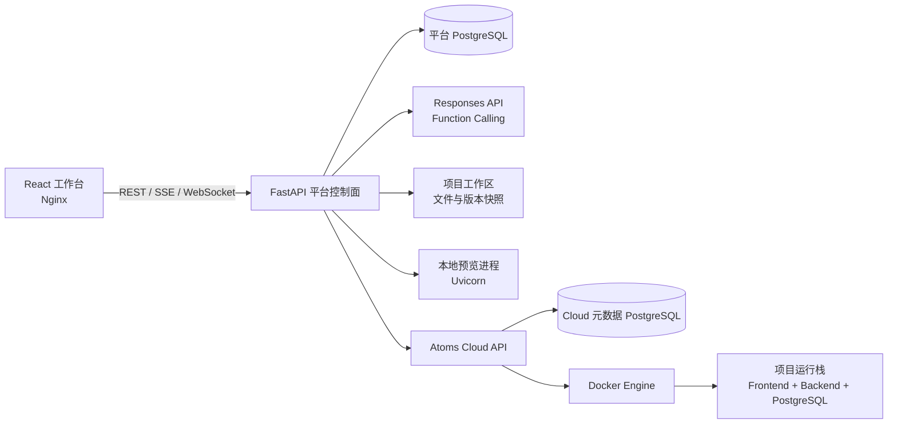
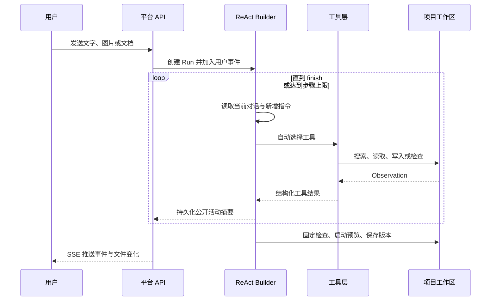

# Atoms Demo 技术架构与实现说明

> 本文面向开发、测试与部署人员，介绍 Atoms Demo 的项目结构、核心模块、数据模型和主要运行链路。当前版本是一个可通过 Docker Compose 一键启动的完整 Demo，包含前端工作台、平台后端、PostgreSQL、项目预览运行时，以及独立的 Atoms Cloud 发布控制服务。

## 1. 总体架构

Atoms Demo 采用“控制面 + 项目运行时 + 发布面”的三层结构：



- **平台控制面**负责登录、项目、运行任务、Agent 事件、文件编辑、版本、预览代理和发布入口。
- **项目运行时**位于持久化工作区中，Agent 对工程文件进行增量修改；检查通过后启动真实预览进程。
- **Atoms Cloud**是独立服务，通过 Docker Socket 构建和管理发布容器。每个项目只允许一套当前运行栈。

前端只连接平台后端。浏览器不会直接访问 Cloud 控制 API，所有 Cloud 操作都由平台后端完成用户权限校验后转发。

## 2. 仓库结构

```text
atoms/
├─ frontend/                    # React + Vite 工作台
│  ├─ src/main.jsx             # 页面、项目工作区、文件树、预览和 Cloud 管理
│  ├─ src/CodeEditor.jsx       # Monaco Editor、诊断与自动格式化保存
│  ├─ src/TerminalConsole.jsx  # 基于 xterm.js 的交互终端
│  ├─ src/i18n.jsx             # 中英文文案、主题与界面状态
│  └─ nginx.conf               # 静态资源及 /api、/preview 反向代理
├─ backend/                     # 平台控制面
│  ├─ app/main.py              # FastAPI 路由、SSE、WebSocket 与预览代理
│  ├─ app/agent.py             # ReAct 循环、工具执行和公开活动事件
│  ├─ app/workspace.py         # 工程模板、安全路径、固定检查与版本快照
│  ├─ app/preview.py           # 项目预览进程生命周期和端口管理
│  ├─ app/deployments.py       # Atoms Cloud 客户端适配层
│  ├─ app/models.py            # SQLAlchemy 平台数据模型
│  ├─ app/db.py                # 数据库初始化与项目租户 schema
│  └─ tests/                   # 租户、生成模板、Agent 和 Cloud 单元/集成测试
├─ cloud/                       # 独立发布控制服务
│  └─ app/main.py              # 镜像构建、容器、日志、终端和项目下线
├─ tests/e2e/                   # 浏览器验收清单与 Cloud smoke test
├─ docs/                        # 调研和技术文档
└─ docker-compose.yml           # 五个基础服务的一键编排
```

Compose 默认启动 `frontend`、`backend`、`db`、`cloud` 和 `cloud-db`。项目正式发布后，Cloud 会再动态创建项目自己的前端、后端和数据库容器。

## 3. 平台数据模型与租户隔离

平台使用 SQLAlchemy 管理以下核心实体：

| 实体 | 用途 |
|---|---|
| `User` / `Session` | 本地账号、加盐密码和登录会话 |
| `UserPreference` | 语言、主题和默认协作模式 |
| `Project` | 项目名称、模式、图标、状态、归档时间和预览端口 |
| `ProjectTenant` | 项目与 PostgreSQL schema 的唯一映射 |
| `Run` | 一轮用户目标、运行状态、模式和可选产品计划 |
| `AgentEvent` | 按顺序持久化对话、工具、阶段和公开活动摘要 |
| `Version` | 检查通过后的 ZIP 快照及版本号 |
| `Deployment` | 平台侧发布记录及 Cloud 状态镜像 |

创建项目时，后端同时生成 `tenant_<project_uuid>` schema，并写入 `project_tenants`。生成应用只能通过平台注入的 `PROJECT_DATABASE_URL` 和 `PROJECT_TENANT_SCHEMA` 访问数据。`workspace.run_checks()` 会拒绝 SQLite、缺少租户环境变量、没有写接口或前端未调用写接口的工程。

这一设计提供两层隔离：

1. **控制面隔离**：所有项目 API 先根据当前登录用户执行 `project_for_user()` 校验。
2. **业务数据隔离**：不同项目使用不同 schema；发布时，每个项目还拥有独立的 PostgreSQL 容器和命名数据卷。

永久删除归档项目时，会同时清理项目记录、租户 schema、工程目录、版本文件和对应 Cloud 运行资源。普通“一键下线”只删除运行容器，默认保留业务数据卷，便于再次发布。

## 4. Agent 的 ReAct 实现

Agent 主循环位于 `backend/app/agent.py::run_builder()`。当前 `begin_run()` 对团队模式和工程师模式都直接调度同一个 ReAct Builder，避免把修复和追加需求强制套入固定阶段。`mode` 仍作为项目偏好持久化，便于前端表达和后续差异化扩展。代码中保留了结构化计划、批准与退回接口，但它们不是当前默认消息链路；即使存在历史计划，也只作为可调整上下文，不限制后续决策。



当前受控工具包括：

- `list_files`、`read_file`、`search_files`：观察已有工程和定位实现。
- `write_file`、`replace_text`：创建文件或执行一次精确替换，并计算增删行数。
- `run_checks`：执行结构、语法、接口调用和租户持久化检查。
- `publish_project`：标记在版本完成后交给 Cloud 发布。
- `finish`：只有固定检查为绿色时才允许结束。

工具的完整文件内容只进入 Agent 私有 Observation。前端活动流只接收路径、匹配数量、增删行数和简短结果，避免把文件正文或内部推理直接暴露给用户。运行期间新增的用户消息和附件会被 `pending_user_inputs()` 注入下一次迭代，因此不需要停止当前任务重新开始固定流程。

## 5. 实时工作区、编辑器与预览

项目事件以 `AgentEvent` 持久化，并通过 `/api/runs/{run_id}/events/stream` 使用 SSE 推送。前端收到事件后会更新对话、运行状态、变更文件标记和预览版本。页面刷新后可通过普通事件 API 恢复历史，不依赖浏览器内存。

代码区采用 Monaco Editor：

- 后端提供文件列表、读取、更新和格式化 API；所有路径均经过工作区根目录约束。
- 前端以层级目录树展示文件，并根据 Agent 工具事件标识本轮变更。
- Web 文件使用 Prettier，Python 文件由后端格式化；保存时自动格式化并运行固定检查。
- Monaco Worker 提供语法诊断，错误直接显示在编辑器中。

`PreviewManager` 为每个项目维护一个 Uvicorn 预览进程和独立端口。保存或 Agent 完成后会重新检查并按需重启预览。浏览器通过平台的 `/preview/{project_id}` 代理访问，因此预览的 GET、POST、PUT、PATCH 和 DELETE 请求都能正常转发，而不是只展示静态 HTML。

每次成功完成都会把工作区压缩为不可变 ZIP，写入 `Version`。项目导出直接使用当前工程生成 ZIP；正式发布则始终基于已通过检查的版本快照。

## 6. Atoms Cloud 发布与容器管理

平台通过 `AtomsCloudProvider` 把版本快照和项目元数据发送给独立 Cloud API，内部请求使用 `X-Cloud-Key`。Cloud 解压快照后分别构建前端和后端镜像，并为项目维护以下资源：

```text
atoms-frontend-<project>  # Nginx，暴露稳定的随机宿主端口
atoms-backend-<project>   # FastAPI，仅在项目网络内提供 API
atoms-db-<project>        # PostgreSQL 16，挂载项目命名数据卷
```

所有托管资源都带有 `atoms.cloud.managed=true`、项目 ID、部署 ID 和角色标签。Cloud API 只接受带正确标签的容器，平台层还会再次检查容器是否属于当前用户的项目。

重新发布时，Cloud 先删除该项目旧的前端和后端容器，再启动新镜像；数据库容器及数据卷继续复用。因此同一个项目始终只有一套当前前端/后端实例，同时保留跨版本数据。Cloud 还实现了：

- 项目级服务聚合、运行状态和发布 URL；
- 容器启动、停止和重启；
- 只读日志接口，前端自动跟随最新输出；
- WebSocket 双向终端，连接 Docker exec 的 `/bin/sh`；
- 一键下线项目全部容器，以及可选的数据卷删除。

动态容器配置了 CPU、内存和 PID 限制。当前 Cloud 直接挂载 Docker Socket，适用于可信的本地或内部环境；公网多租户部署应替换为隔离 Worker 或 Kubernetes API，并增加镜像扫描、网络策略、命令审计和独立数据库角色。

前端主要状态集中在 `main.jsx`，使用 React Hooks 管理用户、项目、运行和页面导航；`i18n.jsx` 提供双语与主题。终端由 xterm.js 渲染，通过平台 WebSocket 与 Cloud 的 Docker exec 会话桥接。

## 7. 部署、测试与扩展

本地或演示环境的启动方式：

```bash
cp .env.example .env
# 配置模型 API Key
docker compose up --build
```

Compose 健康检查保证各服务按依赖顺序启动。自动化测试覆盖真实 CRUD 与租户隔离、运行中追加消息及附件、Cloud 快照校验与发布；`tests/e2e/cloud-smoke.ps1` 还会执行真实构建、终端、重启、重新发布数据保留和项目下线。

扩展时应保持现有边界：Agent 能力进入受控工具层，新的运行平台实现 Deployment Provider；公网部署则将 Docker Socket 迁移到隔离 Worker 或 Kubernetes。
